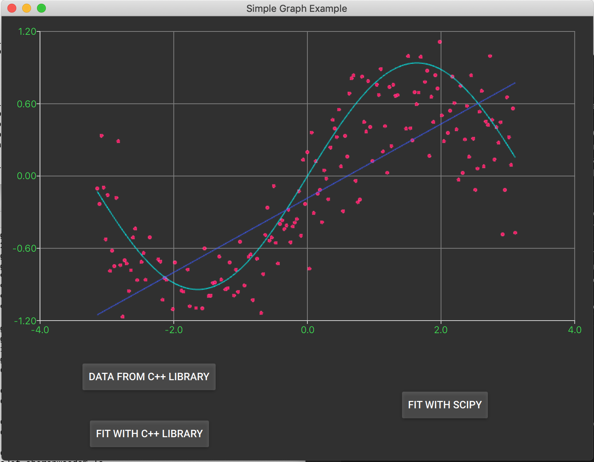

# Shiboken Example
This folder contains two things: 1) a Qt for Python application that
graphs data and uses SciPy to fit a non-linear curve to the data and 2)
the tools to build and wrap a non-Qt based C++ library with Shiboken so
it can be utilized from the Qt for Python application

# Qt for Python application
The example is a contrived demonstration of the following scenario: an
analyst has a legacy C++ library that they are using to extract and fit 
data, but are exploring better fit options using Python's nifty SciPy 
library. They are using Qt for Python to perform the graphing, and Shiboken
to wrap the C++ library with Python bindings so they can get the data and
C++ fit from the Qt for Python graphing application.

Before you can use this example, you need to generate the wrapped library.
See directions below for "Data Library Bindings example"

You can run the application by running python on the simplegraph.py script:

```
python simplegraph.py
```

To plot data on the graph, select the "Data form C++ Library" button. This
calls a data generator within the C++ library through the wrapper generated
by Shiboken.

"Fit with C++ Library" will again use the wrapper to access a linear regression
capability of the C++ library.  The Qt for Python application plots the result.

"Fit with SciPy" uses SciPy to plot a non-linear curve to the C++ generated data.



# Data Library Bindings example

The example defines a CMake project that builds two libraries:
* `libdatafit` - a sample library with two C++ classes.
* `Datafit` - the generated Python extension module that contains
  bindings to the library above.

# Requirements to Build

You will need Qt, PySide2, shiboken2 and the shiboken2_generator to create the wrapper.

PySide2 and shiboken2 come bundled in the PyPl PySide2 package and can be installed with pip.

```
pip install PySide2
```

shiboken2_generator can also be installed from a wheel, but you need to be careful to 
have the same version as your installed PySide2 and shiboken, as well as your Qt. You can
find the wheels at http://download.qt.io/snapshots/ci/pyside/[Qt Version -- e.g. 5.12]/latest/pyside2/

You can also build PySide2, shiboken2 and shiboken2_generator from source. See 
https://wiki.qt.io/Qt_for_Python/GettingStarted for details.

### Building for Linux or Mac

* Open a terminal
* Run build_setup.sh -- this will do the build for you and install the package (which contains the bindings module) into the `site-packages` directory of the Python installation


## Linux Shared Libraries Notes

For this example's purpose, we link against the absolute path of the
dependent shared library `libshiboken` because the
installation of the library is done via a wheel, and there is
no clean solution to include symbolic links in a wheel package
(so that passing -lshiboken to the linker would work).

# To Use
To access the wrapped C++ classes from Python, import them from the Datafit module:

```
from Datafit import DataFitter, DataGenerator
```
The simplegraph.py script shows an example of using the wrapped functions.
